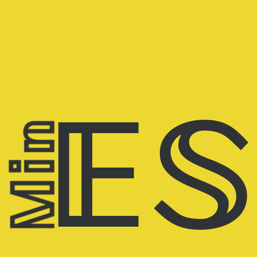

<p align='center'></p>
**UPDATE: 𝔼𝕊𝕄𝕚𝕟 2 has been released!**

𝔼𝕊𝕄𝕚𝕟 (**ES**6 **Min**ified) is a hybrid code-golfing language based on JavaScript ES6. It aims to change the syntax so that most ES6 char combinations can be written with one char.

## The Creation Story of 𝔼𝕊𝕄𝕚𝕟
Just go look at the [commit history](https://github.com/molarmanful/ESMin/commits/gh-pages) and go to the beginning.

- I started making 𝔼𝕊𝕄𝕚𝕟 on October 18, 2015. This was 7 days before TeaScript's first commit on Github; however, TeaScript was used on PPCG before 𝔼𝕊𝕄𝕚𝕟 was.
- Originally, this language was called FOES-6 (Function-Only ES6). The idea was to make a Javascript golfing language that had only functions and nothing else. That changed pretty quickly, though.
- 𝔼𝕊𝕄𝕚𝕟 was supposed to be stack-based - that is, until I realized how bad this was for golfing. I left the stack (which still comes in handy due to its behavior) and focused on the non-stack side of 𝔼𝕊𝕄𝕚𝕟.
- 𝔼𝕊𝕄𝕚𝕟 was the first JSGL (JavaScript Golfing Language) to implement non-function aliases. That was a primary concern of mine from the very beginning.
- I originally had the idea of allowing unclosed parentheses, but that soon became too buggy to implement until Japt came along and implemented that.
- I borrowed a lot of ideas from other JSGL's. Thanks guys, couldn't have done a lot without y'all!
- I didn't know about multibyte Unicode chars until later. By then, it was too late to change all of the aliases. Along the way, I found the doublestruck alphabet, which I used in the language's name.
- Because of this freedom to pick and choose from the Unicode charset, I could make my language much more visually meaningful, like APL. Some may find this unappealing, but I personally think that it makes things much more interesting. This also means that 𝔼𝕊𝕄𝕚𝕟 has the most Unicode aliases out of any of the JSGL's.
- Documentation was a huge problem for 𝔼𝕊𝕄𝕚𝕟, as the specs kept changing and evolving too fast for docs to keep up. This changed with the implementation of Docco.
- 𝔼𝕊𝕄𝕚𝕟 started using libraries like Lodash and Underscore.String, each with their own aliases. This makes many code-golfing challenges trivial and short to answer.


## Quick Examples
```
`Hello, world!`
```
Outputs `Hello, world!`.

```
ℹ)
```
Not-so-true quine.
```
⟮ⒸⅩ222+ᶈ0
```
True quine.

```
⩥⁽1Ṥ
```
Outputs all numbers 1-100.